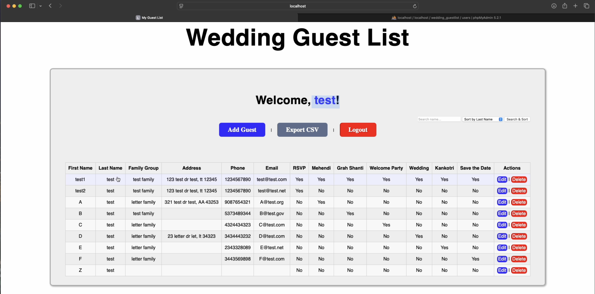
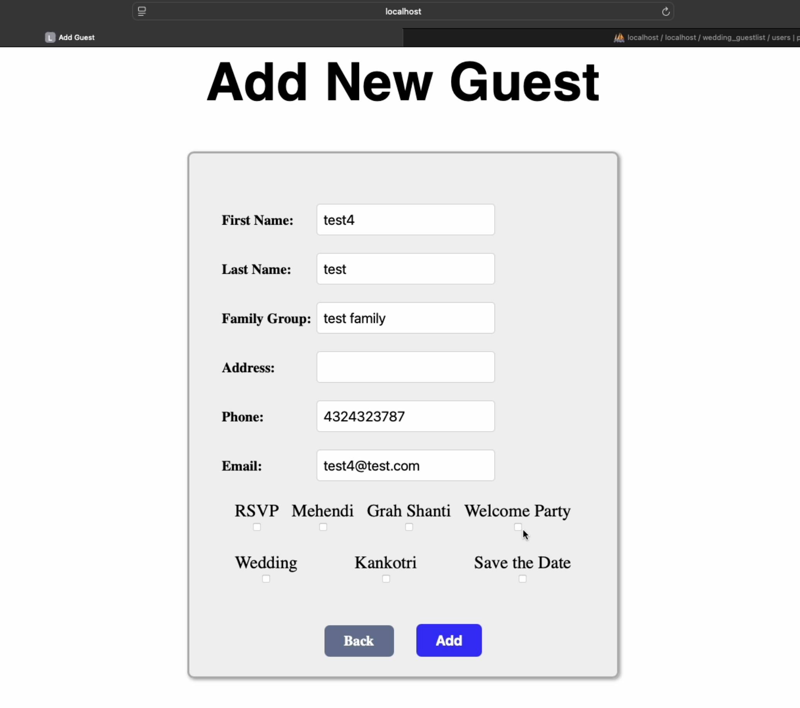

# Wedding Guest List PHP App

A full CRUD web application to manage wedding guest lists with authentication and CSV export. Built with **PHP** and **MySQL**.

## Features
- User registration and login (basic auth with sessions)
- Add, edit, and delete guests (name, email, RSVP, etc.)
- Export guest list to CSV for spreadsheets or printing
- Basic access control with session guard
- Styled with custom CSS
- Includes sample SQL schema for quick setup

## Tech Stack
- PHP 8.1+
- MySQL 8+
- PDO (database access)

## Requirements
- PHP 8.1 or newer with `pdo_mysql` extension enabled
- MySQL server (local or remote)
- Web server (use built-in PHP server for dev)

## How to Run
1. Clone the repository:
   ```bash
   git clone https://github.com/your-username/wedding-guestlist-php.git
   cd wedding-guestlist-php
   mysql -u root -p < sql/wedding_guestlist.sql
   # Update includes/database.php with your MySQL credentials.
   php -S localhost:8000 -t public
   # Open http://localhost:8000 in your browser.
   
## Screenshots


Screenshots live in `docs/screenshots/`.

## Application Walkthrough

### Authentication
- Register a new account with username and password
- Login persists session until logout
- Access to the guestlist requires authentication

### Guest Management
- Add new guests with details (name, email, RSVP status)
- Edit existing guests
- Delete unwanted records
- Table view of all guests

### Export
- Download a full guest list as a CSV file for backup or sharing

---

## License
MIT License – see [LICENSE](LICENSE) for details.
